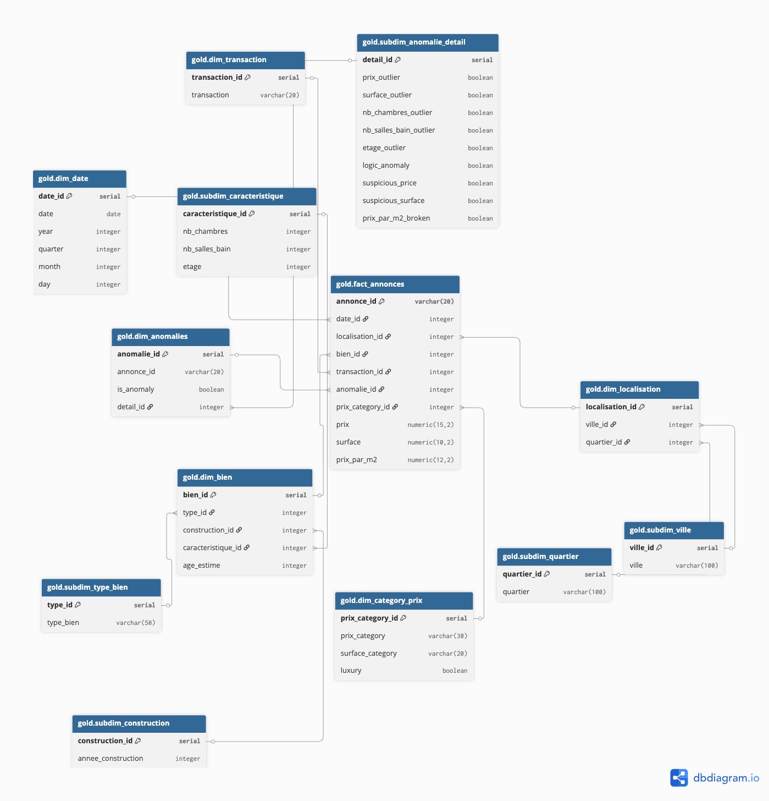

# 🏠 Darkom.ma — Pipeline de Données Immobilières


Pipeline de données industriel complet qui transforme les annonces brutes de **Darkom.ma** en un Data Warehouse Snowflake Schema prêt pour Power BI.

---

## 🎯 Vue d'ensemble

```
CSV Source (darkom_annonces_raw.csv)
        ↓
🥉 Bronze Layer  →  bronze.stg_annonces       (raw, aucune transformation)
        ↓
🥈 Silver Layer  →  silver.annonces_clean      (nettoyage + feature engineering)
        ↓
🥇 Gold Layer    →  gold.* (Snowflake Schema)  (DWH optimisé Power BI)
        ↓
📊 Power BI Dashboard
```

---

## 🧱 Architecture



### Schemas PostgreSQL

| Schema   | Rôle                                        |
|----------|---------------------------------------------|
| `bronze` | Données brutes — copie exacte du CSV        |
| `silver` | Données nettoyées + features engineered     |
| `gold`   | Snowflake Schema — tables DWH pour Power BI |
| `audit`  | Logs de chargement (`load_logs`)            |

### ⭐ Snowflake Schema (Gold)

```
gold.fact_annonces
   ├── gold.dim_date
   │       └── (year, quarter, month, day)
   ├── gold.dim_localisation
   │       ├── gold.subdim_ville
   │       └── gold.subdim_quartier
   ├── gold.dim_bien
   │       ├── gold.subdim_type_bien
   │       ├── gold.subdim_construction
   │       └── gold.subdim_caracteristique
   ├── gold.dim_transaction
   ├── gold.dim_category      (prix_category + surface_category)
   ├── gold.dim_anomalies
   │       └── gold.subdim_anomalie_detail
```

---

## 🛠️ Stack Technique

| Outil          | Rôle                           |
|----------------|--------------------------------|
| Python 3.11    | ETL & transformations          |
| PostgreSQL 16  | Data Warehouse                 |
| SQLAlchemy     | Connexion & ORM léger          |
| pandas         | Manipulation des données       |
| python-dotenv  | Gestion des variables d'env    |
| Power BI       | Dashboards BI                  |

---

## 📁 Structure du Projet

```
jeury-brief/
├── data/
│   ├── bronze/                  # CSV source (immuable)
│   │   └── darkom_annonces_raw.csv
│   ├── silver/                  # CSV nettoyé
│   │   └── data_clean.csv
│   └── gold/bi/                 # Export DWH prêt Power BI
│       └── data_warehouse_ready.csv
├── docs/
│   ├── architecturemok.png
│   ├── log-analysis.md          # Guide d'analyse des logs
│   └── TROUBLESHOOTING.md       # Guide de dépannage
├── logs/                        # Logs par couche
│   ├── pipeline.log
│   ├── staging.log
│   ├── clean.log
│   ├── bi_schema.log
│   ├── migrations.log
│   ├── db.log
│   └── validate.log
├── notebook/
│   └── Data_preparation_logic.ipynb
├── src/
│   ├── config.py                # Constantes & chemins
│   ├── pipeline.py              # Orchestrateur principal
│   ├── staging/
│   │   └── load_staging.py      # 🥉 Bronze Layer
│   ├── clean/
│   │   └── clean_data.py        # 🥈 Silver Layer
│   ├── warehouse/
│   │   └── bi_schema.py         # 🥇 Gold Layer (Snowflake Schema)
│   └── utils/
│       ├── db.py                # Connexion PostgreSQL
│       ├── logger.py            # Logging centralisé
│       ├── migrations.py        # Création des schemas & tables
│       └── validate.py          # Validation du DWH
├── .env                         # Variables d'environnement (non versionné)
├── .env.example                 # Modèle de configuration
├── requirements.txt
├── Makefile
└── CHANGELOG.md
```

---

## ⚙️ Installation & Configuration

### 1. Cloner le dépôt

```bash
git clone https://github.com/badre2152/test.git
cd jeury-brief
```

### 2. Créer l'environnement virtuel

```bash
python -m venv venv
source venv/bin/activate       # macOS / Linux
venv\Scripts\activate          # Windows
```

### 3. Installer les dépendances

```bash
make install
# ou
pip install -r requirements.txt
```

### 4. Configurer les variables d'environnement

Copier `.env.example` en `.env` et remplir vos valeurs :

```bash
cp .env.example .env
```

```dotenv
DB_HOST=localhost
DB_PORT=5432
DB_NAME=darkom_dwh
DB_USER=postgres
DB_PASSWORD=ton_mot_de_passe
```

### 5. Créer la base de données

Se connecter en tant que superutilisateur PostgreSQL puis exécuter :

```sql
CREATE DATABASE darkom_dwh;

-- (Optionnel) Si vous utilisez un utilisateur dédié :
CREATE USER darkom_user WITH PASSWORD 'votre_mot_de_passe';
GRANT ALL PRIVILEGES ON DATABASE darkom_dwh TO darkom_user;

\c darkom_dwh
GRANT ALL ON SCHEMA public TO darkom_user;
```

> **Astuce** : sous macOS avec Homebrew, lancez `psql postgres` pour ouvrir le shell superutilisateur.

---

## 🚀 Lancer le Pipeline

### Pipeline complet (recommandé)

```bash
make pipeline
```

> Le CSV par défaut est `data/bronze/darkom_annonces_raw.csv`. Si le fichier source se trouve déjà dans ce répertoire, le pipeline l'utilise directement sans recopie.

### Couches individuelles

```bash
make migrate                                        # Créer schemas & tables (une seule fois)
make bronze CSV=data/bronze/darkom_annonces_raw.csv # Charger le CSV brut
make silver                                         # Nettoyer + feature engineering
make gold                                           # Construire le Snowflake Schema
make validate                                       # Valider la cohérence du DWH
```

### Repartir de zéro

```bash
make clean-db   # Supprime les schemas bronze / silver / gold
make pipeline   # Recrée tout depuis le CSV
```

---

## 🔄 Détail des Couches

### 🥉 Bronze — `src/staging/load_staging.py`

- Vérifie si le CSV source est déjà dans `data/bronze/` — recopie uniquement si nécessaire
- Charge toutes les colonnes en `TEXT` dans `bronze.stg_annonces` (truncate + reload idempotent)
- Enregistre un log dans `audit.load_logs`

### 🥈 Silver — `src/clean/clean_data.py`

Transformations appliquées :

| Étape | Traitement |
|-------|------------|
| Doublons | `drop_duplicates` — 8 lignes supprimées |
| Types | Conversion DATE, NUMERIC |
| Villes | Normalisation + regex (`casa*` → `casablanca`) |
| Quartiers | Imputation par mode (ville) |
| type_bien | Déduction depuis le titre si null |
| transaction | Imputation par quantile de prix (vente/location) ; les lignes dont le type reste indéterminé sont **supprimées** |
| nb_chambres / nb_salles_bain / etage | Médiane par (ville, type_bien) |
| annee_construction | Mode par (ville, type_bien) |
| Outliers | IQR × 1.5 sur prix, surface, chambres |
| Anomalies | Logique métier (surface > 30 m² sans sdb) |

> **Règle transaction** : seules les valeurs `vente` et `location` sont acceptées. Toute ligne avec un type de transaction indéterminé après imputation est retirée du dataset Silver — elle n'atteint pas Gold.

**Features créées :**

| Feature | Calcul |
|---------|--------|
| `prix_par_m2` | prix ÷ surface |
| `age_estime` | année courante − annee_construction (min 0) |
| `categorie_prix` | Quantiles Q1/Q2/Q3 → economique / moyen / haut_standing / luxe |
| `categorie_surface` | < 80 m² → petit, 80–150 → moyen, > 150 → grand |
| `year`, `month`, `quarter`, `day` | Extrait de date_publication |
| `is_anomaly`, `luxury`, flags outliers | Booléens de qualité |

### 🥇 Gold — `src/warehouse/bi_schema.py`

- Construit le Snowflake Schema dans le schema `gold`
- `dim_transaction` contient exactement 2 valeurs : `location` et `vente`
- `dim_anomalies` contient uniquement `annonce_id`, `is_anomaly` et `detail_id` (FK)
- `subdim_anomalie_detail` contient les 9 flags de détail (prix_outlier, surface_outlier, etc.) — une combinaison unique de flags = une ligne
- Crée les indexes sur toutes les FK de `fact_annonces`
- Exporte `data/gold/bi/data_warehouse_ready.csv` (vue dénormalisée pour Power BI)

---

## 📊 Connexion Power BI

1. Ouvrir Power BI Desktop
2. **Obtenir les données** → **PostgreSQL**
3. Serveur : `localhost:5432` | Base : `darkom_dwh`
4. Importer les tables du schema `gold` :
   - `fact_annonces` + toutes les `dim_*` et `subdim_*`
5. Alternativement : importer directement `data/gold/bi/data_warehouse_ready.csv`

---

## ✅ Validation

```bash
make validate
```

Vérifie :
- Cohérence des lignes Silver → Gold (fact_annonces)
- Intégrité des FK (aucune clé orpheline)
- Complétude des colonnes requises
- Plages de valeurs (prix, surface, age_estime)
- Résumé des anomalies et doublons

---

## 📋 Logs

Tous les logs sont écrits dans `logs/` :

```
logs/migrations.log   → Création des schemas
logs/staging.log      → Bronze layer
logs/clean.log        → Silver layer
logs/bi_schema.log    → Gold layer
logs/pipeline.log     → Pipeline complet (toutes les couches)
logs/db.log           → Connexions PostgreSQL
logs/validate.log     → Validation du Data Warehouse
```

---

## 👤 Auteur

**BRAHIM BADRE** — Data Engineering & Analytics

---

## 📄 Licence

Ce projet est sous licence MIT. Voir [LICENSE/LICENSE.txt](LICENSE/LICENSE.txt).